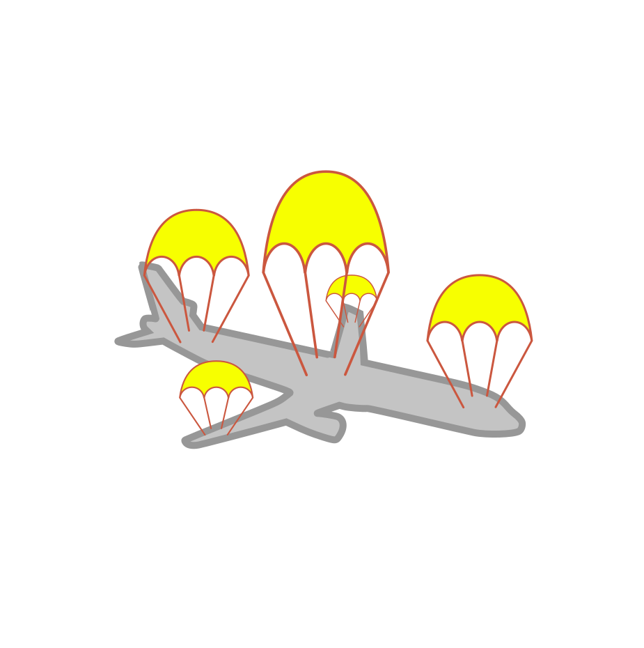
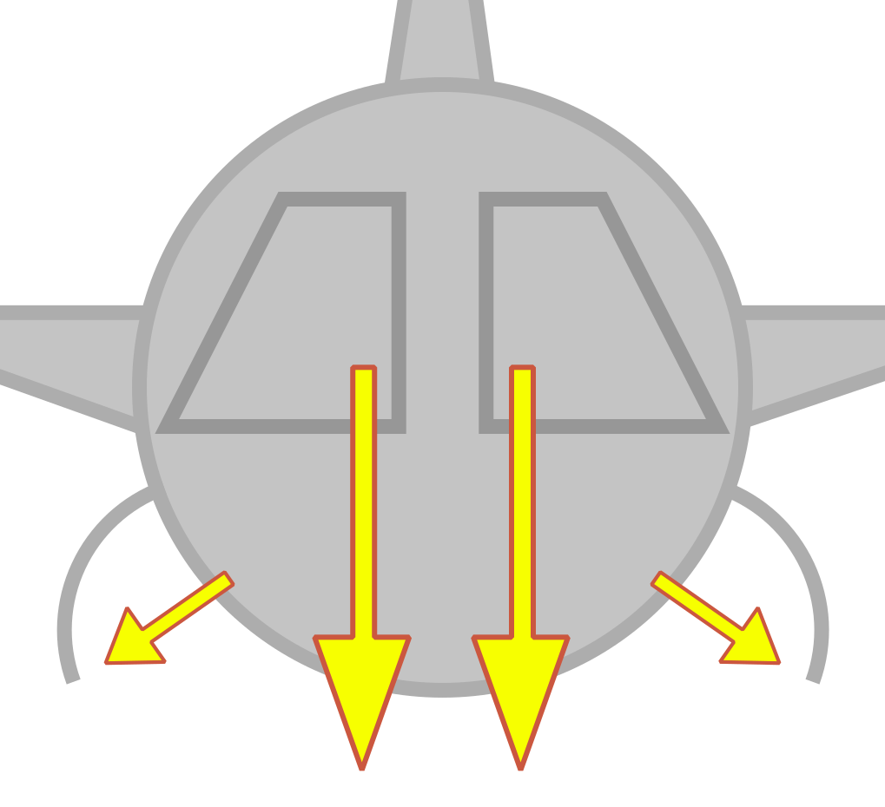
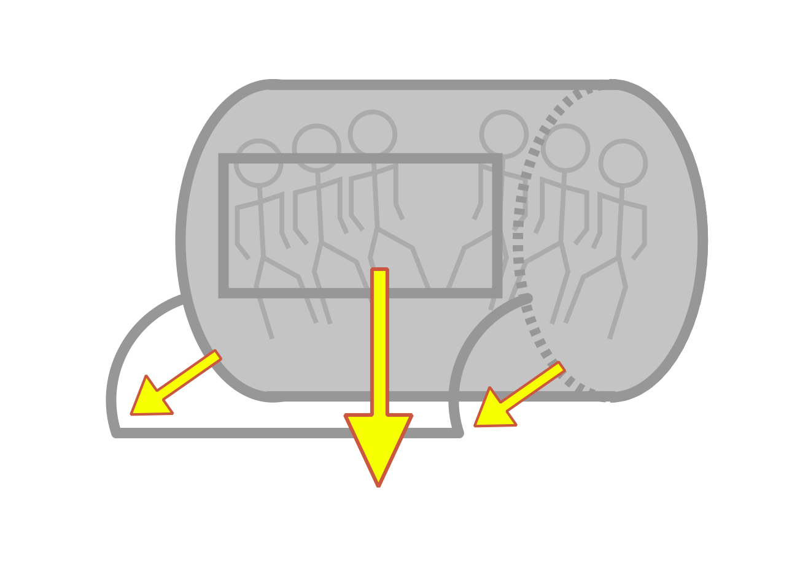
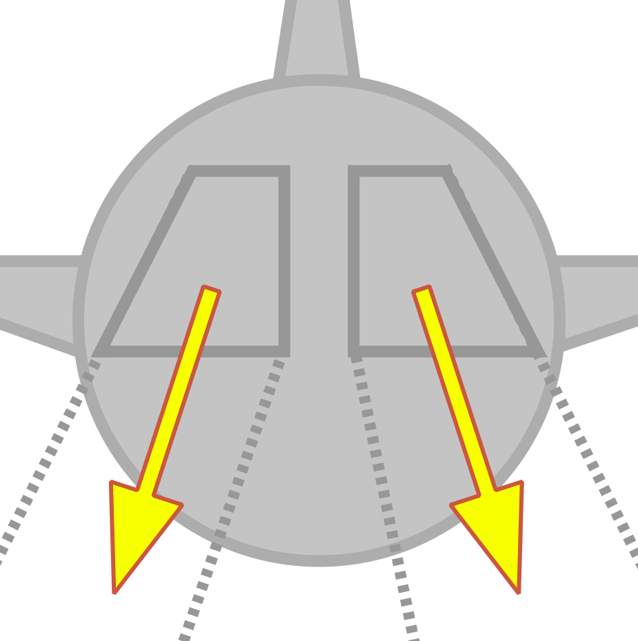

# Airplane Safety

## Abstract

I should begin by stating that I am not a mechanic, but a high-school Physics professor.

After a couple of recent tragic airplane accidents, which are pretty rare but when they occur they can be quite shocking as the chance of survival is next to zero, I have put some thought on how the loss of human lives can be minimized.

Unfortunately, the engines and some of the aircraft subsystems can malfunction or stop operating entirely. Most of these parts are essential for the flight operation, thus the loss of these parts certainly puts the whole aircraft at risk.

The best option is fixing those issues during flight, which can be a really challenging but not totally infeasible task, and this should be the end goal for airplane safety.

Until this goal is fulfilled though, there must be a way both passengers and crew can be saved in the unfortunate event of an airplane malfunction.

## Ideas - Proposals

### First idea
**“Complete rescue of the airplane”**

An Airbus A320 has a maximum take-off weight of approximately 75 tons and a maximum fuel weight of 19 tons, meaning that not counting the fuel we would need to land approximately 56 tons.

The solution can be a series of the top-of-the-line parachutes in various places in the aircraft (3 to 7 parachutes across the length of the fuselage and one at each engine) and airbags beneath the fuselage, which is really close to the mechanism that some smaller aircrafts already have (e.g. Cirrus). (Fig 1)

This idea can be quite hard for large aircrafts -due to the weight- but not infeasible.

### Second Idea
**“Detachable cabin”**

The idea of the detachable cabin, in other words the detachment of the lower part of the fuselage from the rest of the aircraft, is a solution that can be applied, but again the weight is significant and also it would be extremely challenging to detach the lower part of the fuselage if the aircraft had taken a vertical course.

### Third Idea 
**The recommended one**

Because of the reasons explained above, the first two ideas might sound really difficult to implement. With that in mind, it is probably preferable for passengers to sit in “chambers” that host 6 to 12 people, which -in case of an emergency- will be detached from the aircraft, after being automatically and securely airlocked.

Due to the existence of side and back wings, those chambers should probably be detached not horizontally, but either vertically down, or sideways to the front-down direction, so that there is no need for strong chamber launch mechanisms.

For the first case, where the chambers will fall vertically, this can be achieved by opening the hatches below, just like the hatches found in bomber warplanes, and the chambers can be detached in couples, so that the airplane can remain rigid and stable. (Fig 2, 3)

For the second case, where the chambers will fall sideways to the front-down direction, the hatches will open while moving downwards tangentially to the fuselage and the chambers can slide down on rails, after being detached. Due to the fact that the aircraft might be falling vertically, it might be a good idea to use a simple mechanical apparatus that will launch the chamber (e.g. using compressed springs). (Fig 4)

From the moment the chambers (around 15) will be detached, which lasts for about a minute, the last people to be ejected using a similar mechanism, will be the pilots. From there on, the problem becomes landing the aircraft with the least amount of damages, using the mechanisms described in the first idea.

## Details

### “Passenger chambers”

Each chamber will host two parachutes which will open five (5) seconds after detaching the chamber from the aircraft, with two layers of airbags (Fig 5), which will fill up via a pump powered by a winged system that will be activated due to the fall of the chamber. Using a positioning system, each chamber will also provide its location to a satellite.

### “Chamber detachment” mechanisms

Due to the fact that the aircraft electronic systems might stop operating, the mechanisms have to be mechanical where applicable, and any basic functionality should be able to be completed just by using “one and only lever”.

This means that, each chamber should include:

* One lever to secure its front and back doors,
* One lever to detach itself,
* One lever to open the parachutes and
* One lever to open the airbag.

As there have been cases where the pilots deliberately crashed the airplane to the ground, there is probably need for those mechanisms to be controlled from the airplane control tower as well, electrically using radio-waves.

As mentioned before, in the mechanism to fill the airbag, the system that is responsible to broadcast the location of the chamber should also include a battery-backed generator which will be powered by a winged system, while the chamber is falling.

#### Levers to Secure the Chambers

Those levers will close and secure the sliding doors that will connect/divide the chambers from one another.

#### Lever to Detach the Chamber

This lever will have a dual role:

* It should open the appropriate hatch and
* It should release the chamber from the aircraft, so that, with the help of the chamber launch mechanism, the chamber will be separated from the aircraft.

#### Parachute levers

This lever will open the parachute almost at the same time, so that the chamber will stabilize soon after getting detached from the aircraft.

#### Airbag lever

This lever will expose a small winged system outside the chamber, which will power the airbag and the position tracking subsystems.

### Chamber subsystems

* After the lever to secure the chamber is used, along with the sliding doors, the air conditioning system should be disabled as there is no need to be enabled for the limited amount of time that the chamber will be falling.
* Furthermore, a pressure valve must always check and control the pressure of the chamber.

## Conclusion

I am aware that all of the above ideas might not be feasible and they may be forgotten.

If, however, they are of interest, I will always remain at your disposal.

In any case, I hope that they will convey the need for more secure flights to the aircraft safety mechanics, so that maybe some ideas will be implemented for the sake of humanity.

**Panagiotis S. Petrakis**
